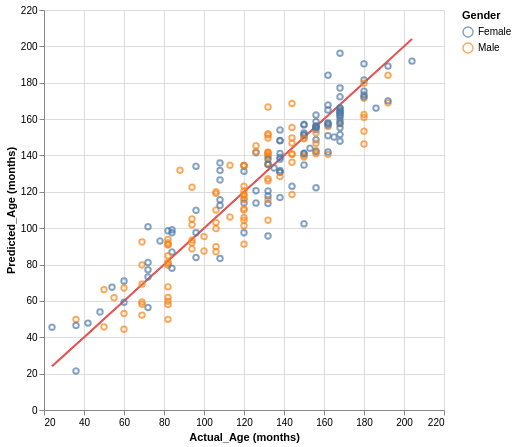

# Bone_Age_Prediction
Predicting age of child from X-ray image of hand

## Table of Contents
 <ol>
   <li><a href="#head1"> Libraries and tools used</a>
   <li><a href="#head2"> Motivation of the project </a>
   <li><a href="#head3"> Instructions </a>
   <li><a href="#head4"> Summary of the results </a>
   <li><a href="#head5"> Acknowledgements </a>
   <li><a href="#head6"> Author </a>
</ol>

<h2 id="head1"> Libraries and tools used: </h2>
<ul>
 <li> os
 <li> numpy
 <li> pandas
 <li> glob
 <li> tqdm
 <li> h5py
 <li> sklearn 
 <li> skimage
 <li> keras
</ul>

<h2 id="head2"> Motivation of the project</h2>
In television series Bones, forensic anthropologist, Dr. Temperance "Bones" Brennan’s ability to predict a number of qualities of a person just by examining bone X-rays, captured my imagination. So when I came across a bones dataset in Kaggle I decided to apply my newly acquired skills in Deep Neural Networks.

<h2 id="head3"> Instructions </h2>

1. Specify the path for image folders and csv file with gender and bone age information. Run the cells in BoneAge_DataProcessing notebook to save extracted features as npz files.

2. Run the cells in BoneAge_Prediction notebook to train a Convolution Neural Network and predict the ages of test images. The final predictions are saved as a CSV file.

<h2 id="head4"> Summary of the results </h2>

For test images, the predicted ages have a Mean Absolute Difference of 11.33. Below is a chart showing the actual and predicted ages.

<h2 id="head5"> Acknowledgements </h2>

<ul>
 <li> Kaggle https://www.kaggle.com/kmader/rsna-bone-age
</ul>

<h2 id="head7"> Author </h2>

Shahzeb Akhtar
https://www.linkedin.com/in/shahzebakhtar/
